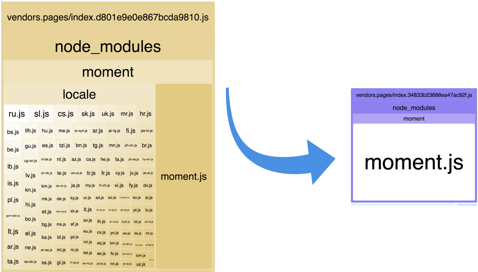

# @nuxtjs/moment

[![npm version][npm-version-src]][npm-version-href]
[![npm downloads][npm-downloads-src]][npm-downloads-href]
[![Circle CI][circle-ci-src]][circle-ci-href]
[![Codecov][codecov-src]][codecov-href]
[![Dependencies][david-dm-src]][david-dm-href]
[![Standard JS][standard-js-src]][standard-js-href]

> Easily remove unused Moment.js locales in Nuxt.js projects using [moment-locales-webpack-plugin](https://github.com/iamakulov/moment-locales-webpack-plugin).

[📖 **Release Notes**](./CHANGELOG.md)

<p align="center"></p>

## Setup

1. Add the `@nuxtjs/moment` dependency with `yarn` or `npm` to your project
2. Add `@nuxtjs/moment` to the `modules` section of `nuxt.config.js`
3. Configure it:

To strip all locales except “en”:

```js
{
  modules: [
    '@nuxtjs/moment',
  ]
}
```

Or to strip all locales except “en”, “es-us” and “fa“

```js
{
  modules: [
    ['@nuxtjs/moment', ['fa']]
  ]
}

// or

{
  modules: [
    '@nuxtjs/moment'
  ],
  moment: {
    locales: ['fa']
  }
}
```

**Note:** “en” is built into Moment and can’t be removed)

### Set default locale

You can set a default locale via the `defaultLocale` option. It must be included
int the locales you keep (or `'en'`) and will only work when using the plugin option.

```js
  modules: [
    ['@nuxtjs/moment', { locales: ['de'], defaultLocale: 'de' }]
 ]
```

### Disable plugin

This module also registers a nuxt plugin to include all needed locales as well as injecting moment as `$moment` to Vue context. You can disable this behaviour using an object config:

```js
  modules: [
    ['@nuxtjs/moment', { locales: ['es-us', 'ru'], plugin: false }]
 ]
```

## Development

1. Clone this repository
2. Install dependencies using `yarn install` or `npm install`
3. Start development server using `npm run dev`

## License

[MIT License](./LICENSE)

Thanks [Ivan Akulov](https://github.com/iamakulov) for making this awesome webpack plugin. 💖

Copyright (c) Nuxt Community

<!-- Badges -->
[npm-version-src]: https://img.shields.io/npm/dt/@nuxtjs/moment.svg?style=flat-square
[npm-version-href]: https://npmjs.com/package/@nuxtjs/moment
[npm-downloads-src]: https://img.shields.io/npm/v/@nuxtjs/moment/latest.svg?style=flat-square
[npm-downloads-href]: https://npmjs.com/package/@nuxtjs/moment
[circle-ci-src]: https://img.shields.io/circleci/project/github/nuxt-community/moment-module.svg?style=flat-square
[circle-ci-href]: https://circleci.com/gh/nuxt-community/moment-module
[codecov-src]: https://img.shields.io/codecov/c/github/nuxt-community/moment-module.svg?style=flat-square
[codecov-href]: https://codecov.io/gh/nuxt-community/moment-module
[david-dm-src]: https://david-dm.org/nuxt-community/moment-module/status.svg?style=flat-square
[david-dm-href]: https://david-dm.org/nuxt-community/moment-module
[standard-js-src]: https://img.shields.io/badge/code_style-standard-brightgreen.svg?style=flat-square
[standard-js-href]: https://standardjs.com
